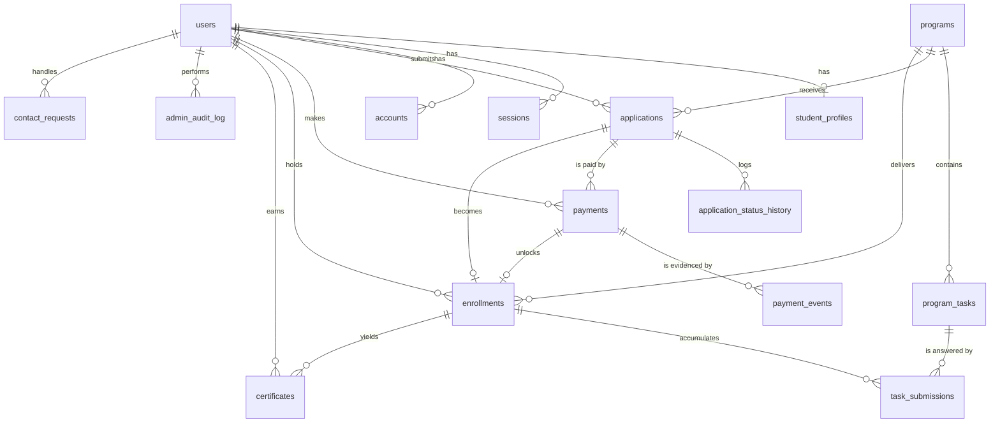

# Tecxcodr — Database Schema

**Version:** 1.0 (MVP) · **Date:** 2026-08-24 · **Engine:** Neon PostgreSQL 16 · **ORM:** Drizzle
**Derives from:** [`00-PRODUCT-DECISIONS.md`](00-PRODUCT-DECISIONS.md) · [`01-PRD.md`](01-PRD.md) · [`02-TRD.md`](02-TRD.md) §5

> Conceptual schema. Types are written as SQL for precision; the Drizzle definitions in `src/server/db/schema/` are the implementation of this document. Migration SQL is not generated here.

---

## 1. Conventions

| Rule | Detail |
|---|---|
| Primary keys | `uuid` (v7 — time-sortable, so B-tree inserts stay local while remaining non-enumerable) |
| Timestamps | `timestamptz`, always UTC. `created_at`/`updated_at` on every mutable table, `DEFAULT now()` |
| Money | `integer` **minor units** (paise) + `currency char(3)`. Never float, never numeric |
| Naming | `snake_case`, plural tables, `<entity>_id` foreign keys |
| Soft delete | `deleted_at timestamptz` on `users`, `programs`, `program_tasks` **only**. History and financial tables are append-only and never deleted |
| Enums | Native Postgres enums for closed sets. Adding a value is an explicit migration |
| FK policy | `RESTRICT` by default (financial/history integrity). `CASCADE` only where the child is meaningless without the parent (`sessions`, `program_tasks`, `application_status_history`, `task_submissions`) |
| Text | Bounded `varchar(n)` wherever a business limit exists; `text` only for genuinely long-form content |
| Indexes | Every FK used in a `WHERE`/`JOIN` is indexed. Partial indexes preferred where a predicate is always present |

## 2. Entity overview

| # | Table | Rows/yr (est.) | Purpose |
|---|---|---|---|
| 1 | `users` | 2k | Identity + role |
| 2 | `sessions` | high churn | Better Auth sessions |
| 3 | `accounts` | 3k | OAuth links + credential password hash |
| 4 | `verifications` | high churn | Email verification & reset tokens |
| 5 | `student_profiles` | 2k | 1:1 extension of a student user |
| 6 | `programs` | ~10 | Internship programs |
| 7 | `program_tasks` | ~30 | Ordered tasks within a program |
| 8 | `applications` | 5k | A user's application to a program |
| 9 | `application_status_history` | 20k | Append-only transition log |
| 10 | `payments` | 2k | One row per payment attempt |
| 11 | `payment_events` | 6k | Raw gateway webhook events (idempotency) |
| 12 | `enrollments` | 1.5k | Paid, active participation |
| 13 | `task_submissions` | 6k | Attempt-versioned work submissions |
| 14 | `certificates` | 2k | Offer letters + completion certificates |
| 15 | `contact_requests` | 1k | Contact form inbox |
| 16 | `email_log` | 20k | Transactional email audit |
| 17 | `admin_audit_log` | 10k | Admin mutation trail |

**Deliberately absent:** `notifications`, `faqs`, `testimonials`, `system_config`, `categories`, `assessments`, `submissions_files`. Each was in the original brief and each is either cut from MVP (`00` S2–S5) or premature. Adding an unused table costs migrations, seed complexity and admin surface for no delivered value.

## 3. Relationships



**The spine:** `users → applications → payments → enrollments → task_submissions → certificates`. Everything else supports it.

**Cardinality notes**
- `users : student_profiles` is 1:0..1 — admins have no profile row.
- `applications : payments` is 1:0..n (failed attempts are retried) but **at most one `PAID`**, enforced by a partial unique index.
- `applications : enrollments` is 1:0..1 — `enrollments.application_id` is `UNIQUE`.
- `enrollments : certificates` is 1:0..2 — one `OFFER_LETTER`, one `COMPLETION`, enforced by a partial unique index on `(enrollment_id, type)`.
- `(enrollment, program_task) : task_submissions` is 1:0..n across attempts, with **at most one `APPROVED`**.

## 4. Enums

```sql
CREATE TYPE user_role          AS ENUM ('STUDENT','ADMIN','REVIEWER','MENTOR');
CREATE TYPE program_domain     AS ENUM ('WEB_DEVELOPMENT','PYTHON','JAVA','DATA_SCIENCE','ANDROID','CPP_DSA');
CREATE TYPE program_level      AS ENUM ('BEGINNER','INTERMEDIATE','ADVANCED');
CREATE TYPE program_status     AS ENUM ('DRAFT','PUBLISHED','ARCHIVED');
CREATE TYPE experience_level   AS ENUM ('BEGINNER','INTERMEDIATE','ADVANCED');
CREATE TYPE application_status AS ENUM ('DRAFT','SUBMITTED','UNDER_REVIEW','ACCEPTED','REJECTED','WITHDRAWN','EXPIRED');
CREATE TYPE payment_status     AS ENUM ('CREATED','PENDING','PAID','FAILED','REFUNDED');
CREATE TYPE enrollment_status  AS ENUM ('ACTIVE','COMPLETED','EXPIRED','CANCELLED');
CREATE TYPE submission_status  AS ENUM ('SUBMITTED','UNDER_REVIEW','APPROVED','CHANGES_REQUESTED');
CREATE TYPE certificate_type   AS ENUM ('OFFER_LETTER','COMPLETION');
CREATE TYPE certificate_status AS ENUM ('ISSUED','REVOKED');
CREATE TYPE contact_status     AS ENUM ('NEW','IN_PROGRESS','RESOLVED','SPAM');
CREATE TYPE email_status       AS ENUM ('QUEUED','SENT','FAILED','BOUNCED');
```

`REVIEWER` and `MENTOR` exist now precisely so activating them later is a permission change, not a migration (`02-TRD` §6.2).

---

## 5. Tables

### 5.1 `users`
Better Auth owns the core columns; `role` and `deleted_at` are Tecxcodr extensions. **Passwords live in `accounts.password` (provider `credential`), not here** — this is Better Auth's model and it keeps credential material in one place alongside OAuth tokens.

| Column | Type | Constraints |
|---|---|---|
| `id` | `uuid` | PK |
| `email` | `varchar(255)` | NOT NULL |
| `email_verified` | `boolean` | NOT NULL DEFAULT `false` |
| `name` | `varchar(160)` | NOT NULL |
| `image` | `text` | |
| `role` | `user_role` | NOT NULL DEFAULT `'STUDENT'` |
| `created_at` `updated_at` | `timestamptz` | NOT NULL DEFAULT `now()` |
| `deleted_at` | `timestamptz` | |

```sql
CREATE UNIQUE INDEX users_email_lower_uq ON users (lower(email)) WHERE deleted_at IS NULL;
CREATE INDEX users_role_idx     ON users (role) WHERE role <> 'STUDENT';
CREATE INDEX users_created_idx  ON users (created_at DESC);
```
Email is uniquely indexed on `lower(email)` rather than stored raw-unique, so `Aarav@x.com` and `aarav@x.com` cannot both exist. The application also normalises on write.

### 5.2 `sessions` · `accounts` · `verifications`
Better Auth managed. Shapes recorded for completeness.

**`sessions`** — `id` PK · `user_id` FK→`users` **CASCADE** · `token varchar(255)` UNIQUE · `expires_at` · `ip_address` · `user_agent` · timestamps.
`INDEX (user_id)` · `INDEX (expires_at)` (expiry sweep).

**`accounts`** — `id` PK · `user_id` FK→`users` **CASCADE** · `account_id varchar(255)` · `provider_id varchar(40)` · `password text` (credential provider only) · `access_token` · `refresh_token` · `id_token` · `*_expires_at` · `scope` · timestamps.
`UNIQUE (provider_id, account_id)` · `INDEX (user_id)`.

**`verifications`** — `id` PK · `identifier varchar(255)` · `value varchar(255)` · `expires_at` · timestamps.
`INDEX (identifier)` · `INDEX (expires_at)`.

### 5.3 `student_profiles`
1:1 with a student user. `user_id` is both PK and FK — no surrogate key, so a duplicate profile is structurally impossible.

| Column | Type | Constraints |
|---|---|---|
| `user_id` | `uuid` | **PK**, FK→`users` CASCADE |
| `phone` | `varchar(15)` | |
| `city` | `varchar(100)` | |
| `state` | `varchar(100)` | |
| `country` | `char(2)` | NOT NULL DEFAULT `'IN'` |
| `college` | `varchar(200)` | |
| `degree` | `varchar(100)` | |
| `branch` | `varchar(100)` | |
| `current_year` | `smallint` | CHECK `BETWEEN 1 AND 5` |
| `graduation_year` | `smallint` | CHECK `BETWEEN 2000 AND 2100` |
| `experience_level` | `experience_level` | |
| `primary_skills` | `text[]` | CHECK `cardinality <= 12` |
| `languages` | `text[]` | CHECK `cardinality <= 10` |
| `github_url` `linkedin_url` `portfolio_url` | `text` | |
| `created_at` `updated_at` | `timestamptz` | NOT NULL |

No index beyond the PK in MVP. A `GIN` index on `primary_skills` is added only when admin skill-filtering ships — an unused GIN index is pure write cost.

Tighter bounds (`graduation_year` within `current_year ± 8`) are enforced in Zod, not in a `CHECK`, because they are relative to "now" and would rot in the schema.

### 5.4 `programs`

| Column | Type | Constraints |
|---|---|---|
| `id` | `uuid` | PK |
| `slug` | `varchar(80)` | NOT NULL |
| `title` | `varchar(120)` | NOT NULL |
| `tagline` | `varchar(200)` | |
| `summary` | `text` | |
| `description` | `text` | markdown, admin-authored |
| `domain` | `program_domain` | NOT NULL |
| `level` | `program_level` | NOT NULL DEFAULT `'BEGINNER'` |
| `duration_weeks` | `smallint` | NOT NULL DEFAULT `4`, CHECK `BETWEEN 1 AND 52` |
| `total_task_count` | `smallint` | NOT NULL DEFAULT `3`, CHECK `> 0` |
| `required_task_count` | `smallint` | NOT NULL DEFAULT `2`, CHECK `> 0 AND <= total_task_count` |
| `price_amount_minor` | `integer` | NOT NULL, CHECK `>= 0` |
| `currency` | `char(3)` | NOT NULL DEFAULT `'INR'` |
| `cover_image_url` | `text` | Cloudinary public |
| `status` | `program_status` | NOT NULL DEFAULT `'DRAFT'` |
| `seats_total` | `integer` | NULL = unlimited, CHECK `> 0` |
| `sort_order` | `smallint` | NOT NULL DEFAULT `0` |
| `published_at` | `timestamptz` | |
| `created_at` `updated_at` `deleted_at` | `timestamptz` | |

```sql
CREATE UNIQUE INDEX programs_slug_uq  ON programs (slug) WHERE deleted_at IS NULL;
CREATE INDEX programs_catalogue_idx   ON programs (status, sort_order, published_at DESC)
                                      WHERE deleted_at IS NULL;
CREATE INDEX programs_domain_idx      ON programs (domain) WHERE status = 'PUBLISHED';
```

**No `seats_taken` counter.** Seat availability is a `COUNT(*)` against `enrollments_program_status_idx` — at these volumes that is a cheap index-only scan, and a denormalised counter would be a drift risk for a constraint that may never bind. Revisit if `seats_total` is ever set low enough to be contended.

**Application-level invariant (not a DB constraint):** a program cannot move to `PUBLISHED` unless it has at least `total_task_count` non-deleted tasks with non-empty briefs (`01-PRD` FR-1.2, risk M2). This is enforced in `programs.publish()` because it requires a cross-table count that a `CHECK` cannot express.

### 5.5 `program_tasks`

| Column | Type | Constraints |
|---|---|---|
| `id` | `uuid` | PK |
| `program_id` | `uuid` | NOT NULL, FK→`programs` **CASCADE** |
| `position` | `smallint` | NOT NULL, CHECK `>= 1` |
| `title` | `varchar(160)` | NOT NULL |
| `brief` | `text` | NOT NULL — markdown |
| `requirements` | `text` | |
| `resources` | `text` | |
| `estimated_hours` | `smallint` | CHECK `BETWEEN 1 AND 200` |
| `is_required` | `boolean` | NOT NULL DEFAULT `true` |
| `created_at` `updated_at` `deleted_at` | `timestamptz` | |

```sql
CREATE UNIQUE INDEX program_tasks_position_uq ON program_tasks (program_id, position) WHERE deleted_at IS NULL;
CREATE INDEX program_tasks_program_idx        ON program_tasks (program_id) WHERE deleted_at IS NULL;
```

### 5.6 `applications`

| Column | Type | Constraints |
|---|---|---|
| `id` | `uuid` | PK |
| `user_id` | `uuid` | NOT NULL, FK→`users` RESTRICT |
| `program_id` | `uuid` | NOT NULL, FK→`programs` RESTRICT |
| `status` | `application_status` | NOT NULL DEFAULT `'DRAFT'` |
| `current_step` | `smallint` | NOT NULL DEFAULT `1`, CHECK `BETWEEN 1 AND 3` |
| `answers` | `jsonb` | NOT NULL DEFAULT `'{}'` — **snapshot** |
| `motivation` | `text` | |
| `referral_source` | `varchar(60)` | |
| `submitted_at` | `timestamptz` | |
| `decided_at` | `timestamptz` | |
| `decided_by` | `uuid` | FK→`users` SET NULL |
| `rejection_reason` | `text` | |
| `payment_due_at` | `timestamptz` | set on acceptance = `decided_at + 14 days` |
| `created_at` `updated_at` | `timestamptz` | NOT NULL |

```sql
-- one live application per (user, program) — the single most important constraint in the schema
CREATE UNIQUE INDEX applications_active_uq ON applications (user_id, program_id)
  WHERE status IN ('DRAFT','SUBMITTED','UNDER_REVIEW','ACCEPTED');

CREATE INDEX applications_admin_queue_idx ON applications (status, submitted_at DESC)
  WHERE status IN ('SUBMITTED','UNDER_REVIEW');
CREATE INDEX applications_user_idx        ON applications (user_id, created_at DESC);
CREATE INDEX applications_program_idx     ON applications (program_id, status);
CREATE INDEX applications_expiry_idx      ON applications (payment_due_at)
  WHERE status = 'ACCEPTED';

ALTER TABLE applications ADD CONSTRAINT applications_rejection_reason_ck
  CHECK (status <> 'REJECTED' OR rejection_reason IS NOT NULL);
ALTER TABLE applications ADD CONSTRAINT applications_submitted_ck
  CHECK (status = 'DRAFT' OR submitted_at IS NOT NULL);
```

**Why `answers` is a snapshot.** The application records what the student said *at the moment of applying*. Later profile edits must not retroactively rewrite an admin's decision record. `student_profiles` is the mutable prefill source; `applications.answers` is the immutable evidence. Program-specific extra questions also live here, which is exactly the kind of sparse, schema-varying data `jsonb` is for — the columnar fields (`user_id`, `program_id`, `status`) that are actually queried stay relational.

### 5.7 `application_status_history`
Append-only. No `UPDATE`, no `DELETE`, no `updated_at`.

| Column | Type | Constraints |
|---|---|---|
| `id` | `uuid` | PK |
| `application_id` | `uuid` | NOT NULL, FK→`applications` **CASCADE** |
| `from_status` | `application_status` | NULL on creation |
| `to_status` | `application_status` | NOT NULL |
| `actor_user_id` | `uuid` | FK→`users` SET NULL — NULL means `SYSTEM` |
| `actor_kind` | `varchar(10)` | NOT NULL — `'USER'` \| `'ADMIN'` \| `'SYSTEM'` |
| `note` | `text` | |
| `created_at` | `timestamptz` | NOT NULL DEFAULT `now()` |

```sql
CREATE INDEX ash_application_idx ON application_status_history (application_id, created_at);
```
Written inside the same transaction as every status change (`02-TRD` §4.4). This table is what powers the student-facing status timeline (`03-DESIGN-SYSTEM` §5.11) — it is a product feature, not just an audit artifact.

### 5.8 `payments`

| Column | Type | Constraints |
|---|---|---|
| `id` | `uuid` | PK |
| `application_id` | `uuid` | NOT NULL, FK→`applications` RESTRICT |
| `user_id` | `uuid` | NOT NULL, FK→`users` RESTRICT |
| `program_id` | `uuid` | NOT NULL, FK→`programs` RESTRICT |
| `gateway` | `varchar(20)` | NOT NULL DEFAULT `'razorpay'` |
| `gateway_order_id` | `varchar(64)` | NOT NULL |
| `gateway_payment_id` | `varchar(64)` | |
| `amount_minor` | `integer` | NOT NULL, CHECK `> 0` — **frozen at order time** |
| `currency` | `char(3)` | NOT NULL DEFAULT `'INR'` |
| `status` | `payment_status` | NOT NULL DEFAULT `'CREATED'` |
| `method` | `varchar(30)` | upi / card / netbanking |
| `receipt_number` | `varchar(32)` | |
| `failure_code` | `varchar(60)` | |
| `failure_reason` | `text` | |
| `refund_amount_minor` | `integer` | NOT NULL DEFAULT `0`, CHECK `>= 0 AND <= amount_minor` |
| `paid_at` `refunded_at` | `timestamptz` | |
| `created_at` `updated_at` | `timestamptz` | NOT NULL |

```sql
CREATE UNIQUE INDEX payments_order_uq   ON payments (gateway, gateway_order_id);
CREATE UNIQUE INDEX payments_gwpay_uq   ON payments (gateway, gateway_payment_id) WHERE gateway_payment_id IS NOT NULL;
CREATE UNIQUE INDEX payments_receipt_uq ON payments (receipt_number) WHERE receipt_number IS NOT NULL;

-- at most one successful payment per application: the anti-double-charge constraint
CREATE UNIQUE INDEX payments_paid_uq    ON payments (application_id) WHERE status = 'PAID';

CREATE INDEX payments_user_idx      ON payments (user_id, created_at DESC);
CREATE INDEX payments_reconcile_idx ON payments (created_at) WHERE status IN ('CREATED','PENDING');
CREATE INDEX payments_ledger_idx    ON payments (paid_at DESC) WHERE status = 'PAID';
```

**Receipt numbers** are `TCX-INV-<YYYY>-<6-digit sequence>` (e.g. `TCX-INV-2026-000417`), drawn from a dedicated Postgres sequence so they are gapless-enough and monotonically increasing without a table lock:
```sql
CREATE SEQUENCE receipt_number_seq START 1;
-- assigned in the webhook transaction, only on transition to PAID
```
The sequence is read only when a payment actually succeeds, so failed attempts do not consume receipt numbers. Sequence gaps from rolled-back transactions are acceptable and expected — receipt numbers are identifiers, not an accounting series.

`payments_paid_uq` is the constraint that turns "we try not to double-charge" into "the database will not let us". `amount_minor` is copied from `programs.price_amount_minor` at order creation and never re-read, so a price change mid-flight cannot alter what a student owes (`01-PRD` E9).

### 5.9 `payment_events`
The idempotency ledger. Every webhook delivery is written here **before** any business logic runs.

| Column | Type | Constraints |
|---|---|---|
| `id` | `uuid` | PK |
| `gateway` | `varchar(20)` | NOT NULL |
| `event_id` | `varchar(80)` | NOT NULL — gateway's own event identifier |
| `event_type` | `varchar(60)` | NOT NULL |
| `payment_id` | `uuid` | FK→`payments` SET NULL |
| `gateway_order_id` | `varchar(64)` | |
| `gateway_payment_id` | `varchar(64)` | |
| `signature_verified` | `boolean` | NOT NULL |
| `payload` | `jsonb` | NOT NULL — raw body |
| `received_at` | `timestamptz` | NOT NULL DEFAULT `now()` |
| `processed_at` | `timestamptz` | NULL = not yet processed |
| `process_error` | `text` | |

```sql
CREATE UNIQUE INDEX payment_events_uq   ON payment_events (gateway, event_id);
CREATE INDEX payment_events_pending_idx ON payment_events (received_at) WHERE processed_at IS NULL;
CREATE INDEX payment_events_payment_idx ON payment_events (payment_id, received_at DESC);
```

**`payment_events_uq` is the entire idempotency mechanism** (`01-PRD` FR-4.4, E2). The handler attempts the insert first; a unique violation means "already seen", and it returns `200 OK` immediately without touching anything else. Never `SELECT`-then-`INSERT` — that races.

`payload` retains PII, so this table is excluded from any export and is never logged (`02-TRD` §9.3).

### 5.10 `enrollments`

| Column | Type | Constraints |
|---|---|---|
| `id` | `uuid` | PK |
| `user_id` | `uuid` | NOT NULL, FK→`users` RESTRICT |
| `program_id` | `uuid` | NOT NULL, FK→`programs` RESTRICT |
| `application_id` | `uuid` | NOT NULL, **UNIQUE**, FK→`applications` RESTRICT |
| `payment_id` | `uuid` | UNIQUE, FK→`payments` RESTRICT |
| `status` | `enrollment_status` | NOT NULL DEFAULT `'ACTIVE'` |
| `started_at` | `timestamptz` | NOT NULL DEFAULT `now()` |
| `ends_at` | `timestamptz` | NOT NULL — `started_at + programs.duration_weeks` |
| `completed_at` | `timestamptz` | |
| `approved_required_count` | `smallint` | NOT NULL DEFAULT `0`, CHECK `>= 0` |
| `required_task_count` | `smallint` | NOT NULL — **snapshot** of the program's rule at enrolment |
| `created_at` `updated_at` | `timestamptz` | NOT NULL |

```sql
CREATE UNIQUE INDEX enrollments_application_uq ON enrollments (application_id);
CREATE UNIQUE INDEX enrollments_payment_uq     ON enrollments (payment_id) WHERE payment_id IS NOT NULL;
CREATE UNIQUE INDEX enrollments_live_uq        ON enrollments (user_id, program_id)
  WHERE status IN ('ACTIVE','COMPLETED');

CREATE INDEX enrollments_user_idx           ON enrollments (user_id, status);
CREATE INDEX enrollments_program_status_idx ON enrollments (program_id, status);
CREATE INDEX enrollments_expiry_idx         ON enrollments (ends_at) WHERE status = 'ACTIVE';
```

**Two deliberate denormalisations:**

- `approved_required_count` — progress and certificate eligibility are read on nearly every dashboard render. Recomputing them means a join across `task_submissions` and `program_tasks` every time. The counter is incremented **inside the same transaction as the approval**, so it cannot drift from a partial failure. A weekly reconciliation query (§7 Q11) proves this and alerts on any divergence.
- `required_task_count` — snapshotted so that changing a program's rule from "2 of 3" to "3 of 3" does not retroactively un-complete existing students.

`enrollments_application_uq` combined with `payments_paid_uq` makes a double enrolment structurally impossible even under concurrent webhook delivery (`01-PRD` E2, E3).

### 5.11 `task_submissions`

| Column | Type | Constraints |
|---|---|---|
| `id` | `uuid` | PK |
| `enrollment_id` | `uuid` | NOT NULL, FK→`enrollments` **CASCADE** |
| `program_task_id` | `uuid` | NOT NULL, FK→`program_tasks` RESTRICT |
| `attempt` | `smallint` | NOT NULL DEFAULT `1`, CHECK `BETWEEN 1 AND 10` |
| `repo_url` | `text` | NOT NULL |
| `demo_url` | `text` | |
| `notes` | `text` | |
| `status` | `submission_status` | NOT NULL DEFAULT `'SUBMITTED'` |
| `feedback` | `text` | |
| `reviewed_by` | `uuid` | FK→`users` SET NULL |
| `reviewed_at` | `timestamptz` | |
| `submitted_at` | `timestamptz` | NOT NULL DEFAULT `now()` |
| `created_at` `updated_at` | `timestamptz` | NOT NULL |

```sql
CREATE UNIQUE INDEX submissions_attempt_uq ON task_submissions (enrollment_id, program_task_id, attempt);
-- a task can be approved exactly once, ever
CREATE UNIQUE INDEX submissions_approved_uq ON task_submissions (enrollment_id, program_task_id)
  WHERE status = 'APPROVED';

CREATE INDEX submissions_review_queue_idx ON task_submissions (submitted_at)
  WHERE status IN ('SUBMITTED','UNDER_REVIEW');
CREATE INDEX submissions_enrollment_idx   ON task_submissions (enrollment_id, program_task_id, attempt DESC);
CREATE INDEX submissions_repo_idx         ON task_submissions (lower(repo_url));

ALTER TABLE task_submissions ADD CONSTRAINT submissions_reviewed_ck
  CHECK (status NOT IN ('APPROVED','CHANGES_REQUESTED') OR reviewed_at IS NOT NULL);
ALTER TABLE task_submissions ADD CONSTRAINT submissions_feedback_ck
  CHECK (status <> 'CHANGES_REQUESTED' OR feedback IS NOT NULL);
```

`submissions_approved_uq` is what makes `enrollments.approved_required_count` safe to increment — a duplicate approval cannot commit. `submissions_review_queue_idx` is the index the entire admin review experience (`01-PRD` §7.6) depends on; `submissions_repo_idx` powers the duplicate-repo warning badge (E8) with a single equality lookup rather than a scan.

### 5.12 `certificates`

| Column | Type | Constraints |
|---|---|---|
| `id` | `uuid` | PK |
| `code` | `varchar(24)` | NOT NULL, UNIQUE |
| `user_id` | `uuid` | NOT NULL, FK→`users` RESTRICT |
| `enrollment_id` | `uuid` | NOT NULL, FK→`enrollments` RESTRICT |
| `type` | `certificate_type` | NOT NULL |
| `status` | `certificate_status` | NOT NULL DEFAULT `'ISSUED'` |
| `holder_name` | `varchar(160)` | NOT NULL — **snapshot** |
| `program_title` | `varchar(120)` | NOT NULL — **snapshot** |
| `metadata` | `jsonb` | NOT NULL DEFAULT `'{}'` — completed task titles, dates |
| `asset_url` | `text` | private, signed-URL delivery |
| `issued_at` | `timestamptz` | NOT NULL DEFAULT `now()` |
| `issued_by` | `uuid` | FK→`users` SET NULL |
| `revoked_at` | `timestamptz` | |
| `revoke_reason` | `text` | |
| `created_at` `updated_at` | `timestamptz` | NOT NULL |

```sql
CREATE UNIQUE INDEX certificates_code_uq ON certificates (code);
CREATE UNIQUE INDEX certificates_type_uq ON certificates (enrollment_id, type) WHERE status = 'ISSUED';
CREATE INDEX certificates_user_idx       ON certificates (user_id, issued_at DESC);

ALTER TABLE certificates ADD CONSTRAINT certificates_revoked_ck
  CHECK (status <> 'REVOKED' OR revoked_at IS NOT NULL);
```

**Code format:** `TCX-YYMM-XXXXXXXX` where `XXXXXXXX` is 8 characters from Crockford base32 drawn from a CSPRNG — ~40 bits, non-sequential, unambiguous when read aloud or transcribed from a printout. Example: `TCX-2609-7QK4M2XR`. Collisions are handled by retrying on unique violation.

**Why `holder_name` and `program_title` are snapshots:** `/verify/[code]` must render exactly what was certified. If a student later changes their display name or a program is retitled, the certificate must not silently change meaning. This is the whole trust premise of the product (`01-PRD` G2).

Soft-deleting a user does **not** cascade here — certificates remain verifiable after account deletion, which is stated in the Privacy policy (`01-PRD` E16).

### 5.13 `contact_requests`

`id` PK · `name varchar(120)` NOT NULL · `email varchar(255)` NOT NULL · `subject varchar(160)` · `message text` NOT NULL (CHECK length ≤ 4000) · `status contact_status` NOT NULL DEFAULT `'NEW'` · `ip_hash char(64)` (SHA-256 + server salt — never the raw IP) · `user_agent text` · `handled_by uuid` FK→`users` SET NULL · `handled_at timestamptz` · `created_at`.

```sql
CREATE INDEX contact_inbox_idx ON contact_requests (status, created_at DESC);
```

### 5.14 `email_log`

`id` PK · `to_email varchar(255)` NOT NULL · `template varchar(60)` NOT NULL · `subject varchar(200)` · `provider_message_id varchar(120)` · `status email_status` NOT NULL DEFAULT `'QUEUED'` · `error text` · `related_type varchar(40)` · `related_id uuid` · `created_at` · `updated_at`.

```sql
CREATE INDEX email_log_related_idx ON email_log (related_type, related_id, created_at DESC);
CREATE INDEX email_log_failed_idx  ON email_log (created_at DESC) WHERE status IN ('FAILED','BOUNCED');
```
Exists because "did the student actually get the acceptance email?" is the most common support question in this product, and answering it from a provider dashboard is slow. Bodies are never stored — template name + related entity is enough to reconstruct.

### 5.15 `admin_audit_log`

`id` PK · `actor_user_id uuid` FK→`users` SET NULL · `action varchar(60)` NOT NULL · `entity_type varchar(40)` NOT NULL · `entity_id uuid` · `diff jsonb` · `ip_hash char(64)` · `created_at`.

```sql
CREATE INDEX audit_entity_idx ON admin_audit_log (entity_type, entity_id, created_at DESC);
CREATE INDEX audit_actor_idx  ON admin_audit_log (actor_user_id, created_at DESC);
```
Append-only. Written for every admin mutation: accept/reject, publish/unpublish, review, issue/revoke, mark-refunded. `diff` stores before/after for changed fields only, with any PII field redacted to `"[redacted]"`.

---

## 6. State machines

Enforced in the service layer as explicit transition tables. **Any transition not listed is rejected**, and every accepted transition writes history.

### 6.1 Application
```
DRAFT ──submit──► SUBMITTED ──pickup──► UNDER_REVIEW ──accept──► ACCEPTED ──pay──► (enrolled, terminal)
  │                   │                      │                        │
  │                   │                      └──reject──► REJECTED    └──14d unpaid──► EXPIRED
  │                   └──withdraw──► WITHDRAWN
  └──(abandoned)──► stays DRAFT indefinitely
```
Abandoned drafts are **not** deleted. `startApplication` returns the existing draft rather than creating a second one, so a stale draft is a resumable state, not a blocked one. Deleting them would only discard funnel data.

Terminal: `REJECTED`, `WITHDRAWN`, `EXPIRED`, and `ACCEPTED`-with-enrolment.
Guards: `ACCEPTED` → nothing may reject it once a `PAID` payment exists (`01-PRD` E4). `WITHDRAWN` is student-initiated and blocked once paid (E5).

### 6.2 Payment
```
CREATED ──checkout opened──► PENDING ──webhook: captured──► PAID ──refund──► REFUNDED
   │                            │
   └──abandoned──► (reconciled) └──webhook: failed──► FAILED ──retry──► (new payments row)
```
Only `PAID` may create an enrolment. `FAILED` leaves the application `ACCEPTED` and retryable (`01-PRD` FR-4.7); a retry creates a **new** row rather than mutating the failed one, so every attempt stays auditable.

### 6.3 Enrolment
```
ACTIVE ──all required approved──► COMPLETED
   │
   ├──ends_at passed──► EXPIRED
   └──admin/refund──► CANCELLED
```

### 6.4 Submission
```
SUBMITTED ──pickup──► UNDER_REVIEW ──approve──► APPROVED (terminal)
                            │
                            └──request changes──► CHANGES_REQUESTED ──resubmit──► SUBMITTED (attempt+1)
```
`APPROVED` is terminal per `(enrollment, task)` and is enforced by `submissions_approved_uq`.

### 6.5 Certificate
```
ISSUED ──revoke──► REVOKED (terminal)
```
No un-revoke. A mistaken revocation is corrected by issuing a new certificate with a new code, which keeps the audit trail honest.

---

## 7. Query patterns & complexity

`n` = rows in the table, `k` = rows returned. All complexities assume the indexes above are present and used.

**Q1 · Published programs catalogue** — `/programs`
```sql
SELECT id, slug, title, tagline, domain, level, duration_weeks,
       total_task_count, price_amount_minor, cover_image_url
FROM programs
WHERE status = 'PUBLISHED' AND deleted_at IS NULL
ORDER BY sort_order, published_at DESC;
```
`programs_catalogue_idx` → index scan, **O(log n + k)**, k ≈ 10. ISR-cached; runs a handful of times per hour. Domain filtering happens client-side over ~10 rows — a server round-trip for that would be strictly worse.

**Q2 · Program detail + tasks** — `/programs/[slug]`
```sql
SELECT p.*, t.id, t.position, t.title, t.brief, t.estimated_hours, t.is_required
FROM programs p
LEFT JOIN program_tasks t ON t.program_id = p.id AND t.deleted_at IS NULL
WHERE p.slug = $1 AND p.status = 'PUBLISHED' AND p.deleted_at IS NULL
ORDER BY t.position;
```
One query, not two. **O(log n + k)**, k ≈ 3. ISR-cached, tagged `program:{slug}`.

**Q3 · Student's applications** — `/dashboard/applications`
```sql
SELECT a.id, a.status, a.submitted_at, a.decided_at, a.payment_due_at,
       p.slug, p.title, p.price_amount_minor
FROM applications a
JOIN programs p ON p.id = a.program_id
WHERE a.user_id = $1
ORDER BY a.created_at DESC
LIMIT 20 OFFSET $2;
```
`applications_user_idx` → **O(log n + k)**. The `user_id` predicate is the authorisation boundary, in the query, not applied after (`02-TRD` §6.2).

**Q4 · Admin application queue** — `/admin/applications`
```sql
SELECT a.id, a.status, a.submitted_at, u.name, u.email, p.title
FROM applications a
JOIN users u    ON u.id = a.user_id
JOIN programs p ON p.id = a.program_id
WHERE a.status = ANY($1)
ORDER BY a.submitted_at
LIMIT 25 OFFSET $2;
```
`applications_admin_queue_idx` → **O(log n + k)**. Paired with a `COUNT(*)` over the same partial index for pagination — cheap because the partial index only covers pending rows.

**Q5 · Enrolment with per-task latest submission** — `/dashboard/internships/[id]`
The one genuinely interesting query. Naïvely this is an N+1 (fetch tasks, then loop fetching each task's latest submission). Instead, one `LATERAL`:
```sql
SELECT t.id, t.position, t.title, t.brief, t.is_required,
       s.id AS submission_id, s.status, s.attempt, s.feedback,
       s.repo_url, s.submitted_at, s.reviewed_at
FROM program_tasks t
LEFT JOIN LATERAL (
  SELECT * FROM task_submissions ts
  WHERE ts.program_task_id = t.id AND ts.enrollment_id = $1
  ORDER BY ts.attempt DESC
  LIMIT 1
) s ON true
WHERE t.program_id = $2 AND t.deleted_at IS NULL
ORDER BY t.position;
```
**O(t · log n)** where t ≈ 3 — three index seeks against `submissions_enrollment_idx`, whose `attempt DESC` ordering makes each inner lookup a single index step. Constant queries regardless of attempt count. `DISTINCT ON (program_task_id)` is an equivalent formulation; `LATERAL` is used because it also carries the `LIMIT` cleanly.

**Q6 · Admin review queue (oldest first)** — `/admin/reviews`
```sql
SELECT s.id, s.repo_url, s.demo_url, s.notes, s.attempt, s.submitted_at,
       t.title AS task_title, t.requirements,
       u.name AS student_name, p.title AS program_title
FROM task_submissions s
JOIN enrollments   e ON e.id = s.enrollment_id
JOIN users         u ON u.id = e.user_id
JOIN programs      p ON p.id = e.program_id
JOIN program_tasks t ON t.id = s.program_task_id
WHERE s.status IN ('SUBMITTED','UNDER_REVIEW')
ORDER BY s.submitted_at
LIMIT 1 OFFSET $1;
```
`submissions_review_queue_idx` → **O(log n)**. The queue fetches one item at a time by design (`03-DESIGN-SYSTEM` §5.6, keyboard flow) and prefetches the next, so the reviewer never waits.

**Q7 · Certificate verification** — `/verify/[code]`
```sql
SELECT code, type, status, holder_name, program_title,
       issued_at, revoked_at, metadata
FROM certificates
WHERE code = $1;
```
Unique index → **O(log n)**, single row. Selects exactly the public columns; `user_id` and `enrollment_id` never leave the server (`01-PRD` FR-6.4). Cached 300s at the edge, purged on revoke.

**Q8 · Admin overview counts** — `/admin`
```sql
SELECT
  (SELECT count(*) FROM applications      WHERE status IN ('SUBMITTED','UNDER_REVIEW'))          AS pending_applications,
  (SELECT count(*) FROM task_submissions  WHERE status IN ('SUBMITTED','UNDER_REVIEW'))          AS pending_reviews,
  (SELECT count(*) FROM enrollments       WHERE status = 'ACTIVE')                               AS active_enrollments,
  (SELECT coalesce(sum(amount_minor - refund_amount_minor), 0) FROM payments
     WHERE status = 'PAID' AND paid_at >= date_trunc('month', now()))                            AS revenue_month_minor;
```
Four index-only scans over partial indexes — **O(k)** where k is the (small) pending set, not the table size. This is why the partial `WHERE` clauses on those indexes matter: they keep the counted set proportional to work outstanding rather than work ever done.

**Q9 · Payment reconciliation** — hourly cron
```sql
SELECT id, gateway_order_id, created_at
FROM payments
WHERE status IN ('CREATED','PENDING') AND created_at < now() - interval '30 minutes'
ORDER BY created_at
LIMIT 100;
```
`payments_reconcile_idx` → **O(log n + k)**, bounded at 100 per run.

**Q10 · Duplicate repo warning** — admin review sidebar
```sql
SELECT s.id, e.user_id
FROM task_submissions s
JOIN enrollments e ON e.id = s.enrollment_id
WHERE lower(s.repo_url) = lower($1) AND s.enrollment_id <> $2
LIMIT 5;
```
`submissions_repo_idx` → **O(log n + k)**. A warning badge only; no automatic action (`01-PRD` E8).

**Q11 · Counter reconciliation** — weekly integrity check
```sql
SELECT e.id, e.approved_required_count AS stored, count(s.id) AS actual
FROM enrollments e
LEFT JOIN task_submissions s ON s.enrollment_id = e.id AND s.status = 'APPROVED'
LEFT JOIN program_tasks   t ON t.id = s.program_task_id AND t.is_required
GROUP BY e.id, e.approved_required_count
HAVING e.approved_required_count <> count(t.id);
```
Full scan by design, **O(n)** on a small table, run weekly off-peak. Any row returned is a bug and pages the admin — this is the safety net that justifies the denormalisation in §5.10.

## 8. Optimisation strategy

1. **Partial indexes over full indexes** wherever the query always carries the predicate. Every "pending work" index here is partial, so the index stays proportional to the backlog rather than to history — the difference between a queue that stays fast at 100k applications and one that doesn't.
2. **Composite index column order follows predicate order**, most selective first. `(status, submitted_at)` not `(submitted_at, status)` — the queue always filters status and only then orders by time.
3. **Constraints before code.** Double-enrolment, double-approval, double-charge and duplicate live applications are prevented by unique indexes, not by service-layer checks. A service check is a race; a unique index is a guarantee.
4. **No unbounded queries.** Every list has `LIMIT`. Enforced in code review.
5. **N+1 elimination is structural** — `LATERAL`/`JOIN`/`IN`-batch. An `await` inside a `.map()` over a repository call fails review (`02-TRD` §10.4).
6. **Denormalise exactly twice** (§5.10), both inside the writing transaction, both covered by a reconciliation query. Nothing else is denormalised.
7. **`EXPLAIN ANALYZE` any query touching a table over 10k rows** before merge.
8. **jsonb only for genuinely sparse data** (`answers`, `metadata`, `payload`, `diff`). Anything filtered or sorted on is a real column.
9. **Neon pooled endpoint + HTTP driver** in the request path; direct connection only for migrations (`02-TRD` §5).
10. **`ANALYZE` after seeding**, and rely on autovacuum otherwise. Revisit only if the plan degrades.

## 9. Seeding

`pnpm db:seed` produces a working local environment: 1 admin, 6 programs (3 `PUBLISHED` with full task briefs, 2 `DRAFT`, 1 `ARCHIVED`), 18 tasks, 12 students with profiles, and applications distributed across **every** status, including two paid enrolments — one mid-progress with mixed submission states, one complete with both certificates issued.

The seed exists to make every UI state reachable without manual setup, including the ones that are otherwise hard to produce: `REJECTED`, `EXPIRED`, `CHANGES_REQUESTED`, `REVOKED`, and a failed payment. Seed data is deterministic (fixed UUIDs, fixed dates relative to a pinned reference date) so Playwright tests can assert against it.
