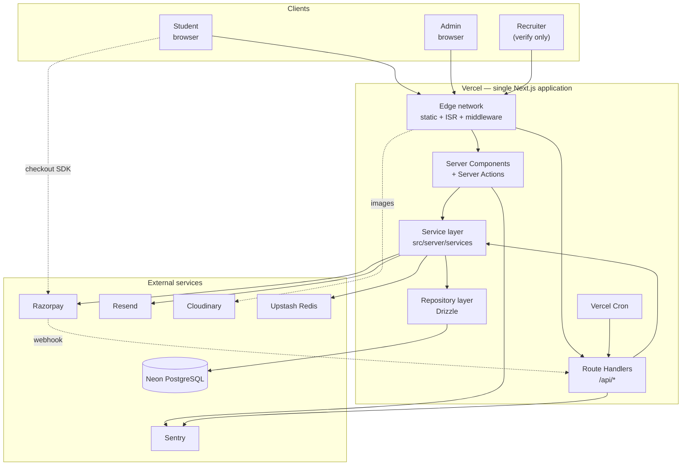
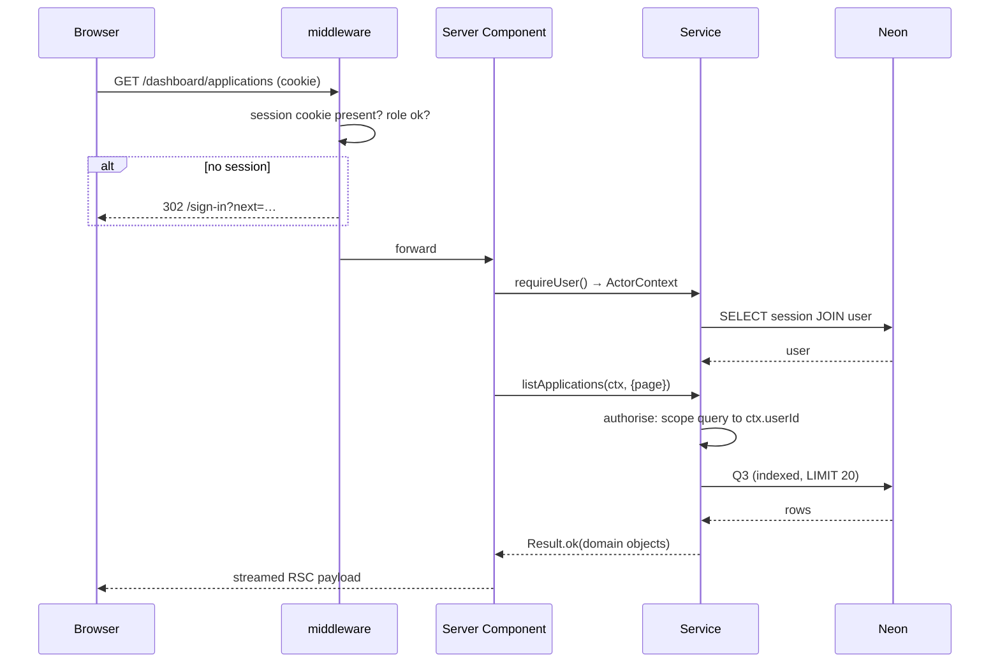
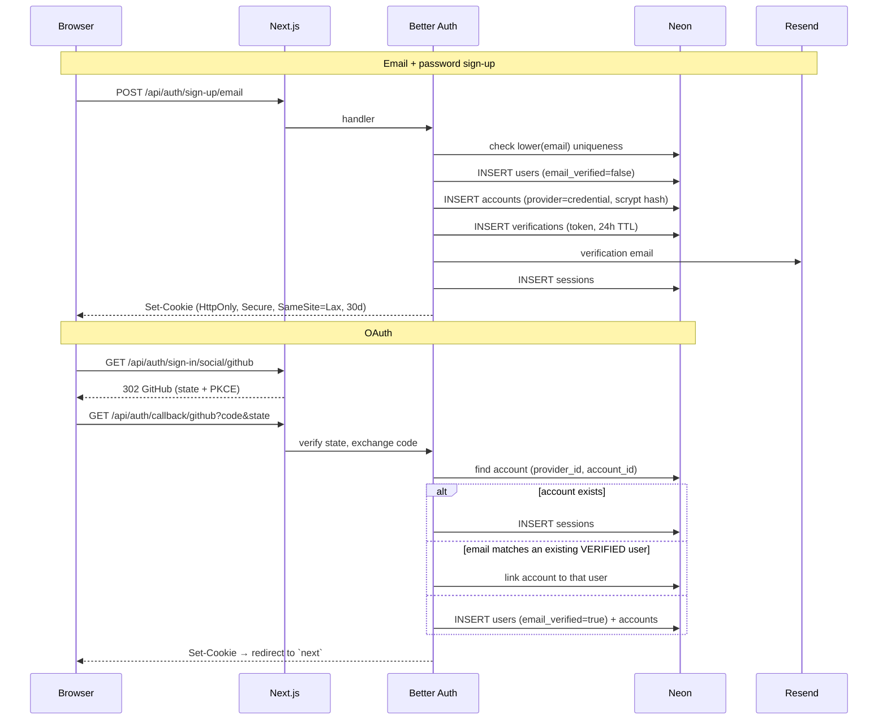
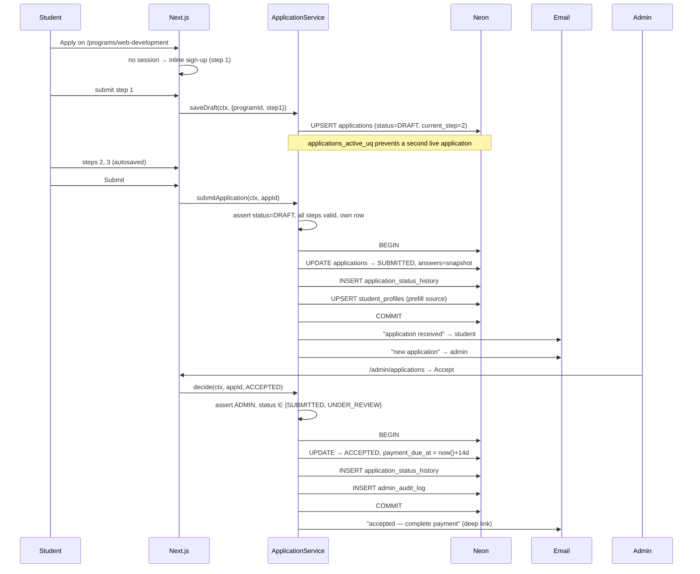
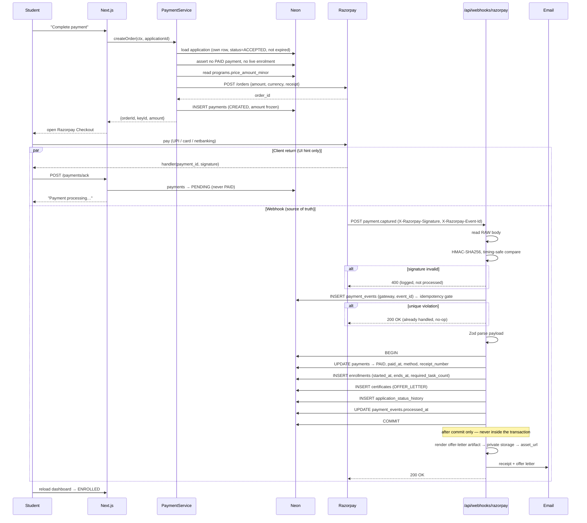
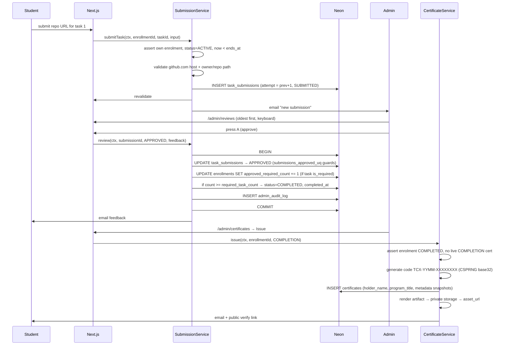
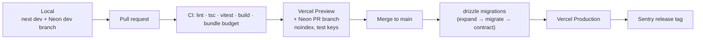

# Tecxcodr — System Architecture

**Version:** 1.0 (MVP) · **Date:** 2026-08-24
**Derives from:** [`00-PRODUCT-DECISIONS.md`](00-PRODUCT-DECISIONS.md) · [`02-TRD.md`](02-TRD.md)

---

## 1. High-level architecture



**One deployable unit.** No separate API service (`02-TRD` §2). The layering inside it — routes → services → repositories → Drizzle — is what keeps a worker extractable later without a rewrite.

### Component responsibilities

| Component | Owns | Never does |
|---|---|---|
| Edge / middleware | static delivery, ISR cache, coarse auth redirect | database access, business decisions |
| Server Components | reading data for render, composing UI | mutations |
| Server Actions | UI-originated mutations, revalidation | business rules |
| Route Handlers | webhooks, third-party-consumed endpoints, CSV, cron | anything a Server Action could do better |
| Service layer | **all business rules**, invariants, transactions, event dispatch | HTTP, cookies, React, `next/*` imports |
| Repository layer | Drizzle queries, mapping rows → domain types | business decisions |

### Trust boundaries

```
UNTRUSTED  browser input · Razorpay checkout callback · webhook body pre-verification · OAuth profile claims
SEMI       verified webhook body (HMAC-checked, still Zod-validated)
TRUSTED    server session · database rows · server-side env
```
Everything crossing left-to-right passes signature verification (where applicable) and then Zod. No exceptions, including for the webhook.

---

## 2. Request lifecycle

### 2.1 Public marketing page (cache hit)
```
Browser → Vercel Edge → [ISR cache HIT] → HTML  ≈ 30–80 ms, zero DB, zero function invocation
```

### 2.2 Authenticated dashboard page


Middleware performs a **cheap redirect only**. The authoritative check is `requireUser()` in the page plus a row-ownership predicate inside the service (`02-TRD` §6.2). Three layers; only the third is a security boundary.

### 2.3 Mutation via Server Action
```
Browser form submit
  → Server Action (framework CSRF verified)
  → requireUser() → ActorContext
  → Zod parse (same schema the client used)
  → service.doThing(ctx, input)
      → authorise
      → BEGIN
          business invariants
          writes + history/audit rows
        COMMIT
      → dispatch email (after commit, never inside)
  → revalidatePath(...)
  → Result → typed form state → inline UI update
```

Failure modes: validation → field errors rendered inline; authorisation → `403`, no data leak in the message; conflict (unique violation) → mapped to a specific `AppError` code, never a raw Postgres error; unexpected → logged with `requestId`, Sentry, generic message.

---

## 3. Authentication flow



**Security properties**
- Account linking only on a **verified** matching email — closes pre-registration account takeover.
- Session is DB-backed, so revocation is immediate (password reset invalidates all sessions).
- Reset tokens are single-use with a 1-hour TTL.
- Auth responses never reveal whether an email is registered.
- Rate limits: sign-in 5/min/IP, sign-up 3/hr/IP, reset 3/hr/email (Upstash).
- Email verification is required before payment, not before applying (`01-PRD` FR-4).

---

## 4. Application flow



**Invariants**
- One live application per `(user, program)` — DB-enforced, not checked-then-inserted.
- `answers` is a snapshot; later profile edits never rewrite it (`04` §5.6).
- Every transition is in `application_status_history`, which is also the student-facing timeline.
- An `ACCEPTED` application with a `PAID` payment cannot be rejected (`01-PRD` E4).
- `payment_due_at` drives the `expire-applications` cron.

---

## 5. Payment flow

The most correctness-critical path in the system. **The webhook is the only writer of enrolment.**



### Guarantees and how each is achieved

| Guarantee | Mechanism |
|---|---|
| Amount cannot be tampered with | Client never sends an amount; server reads `programs.price_amount_minor` and freezes it onto `payments.amount_minor` |
| Forged webhooks rejected | HMAC-SHA256 over the **raw** body with `timingSafeEqual`, before any parsing |
| Replayed webhooks are no-ops | `UNIQUE (gateway, event_id)` on `payment_events` — insert-first, catch unique violation, return 200 |
| No double enrolment | `enrollments_application_uq` + `payments_paid_uq` (`04` §5.8, §5.10). Concurrent deliveries: one commits, one rolls back to a no-op |
| No double charge | `payments_paid_uq` partial unique on `(application_id) WHERE status='PAID'` |
| Enrolment survives a delayed webhook | UI shows "processing", `reconcile-payments` cron settles anything stuck > 30 min by querying Razorpay directly |
| Client can't fake success | `/payments/ack` may only move `CREATED → PENDING`. It is physically incapable of setting `PAID` |
| Money record is auditable | Every attempt is its own `payments` row; every event body is retained in `payment_events` |

**Webhook handler rules**
- `runtime = 'nodejs'` (Node crypto + raw body required).
- Read the raw body **before** any framework parsing.
- Verify → persist the event → then process. Never process before persisting.
- Always return `200` for anything successfully persisted, even if downstream processing fails — otherwise Razorpay retries and amplifies the failure. Failed processing sets `process_error` and is retried by the reconciliation job.
- Reject events older than 5 minutes (timestamp tolerance).
- Handled events: `payment.captured`, `payment.failed`, `refund.processed`. Everything else is persisted and ignored.

**Refunds** (`00` Pay4): initiated in the Razorpay dashboard, not in-app. The `refund.processed` webhook sets `payments.status = REFUNDED`, `refund_amount_minor`, and moves the enrolment to `CANCELLED`. Manual, low-volume, and deliberately not automated in MVP.

---

## 6. Delivery & certification flow



**Verification** — `/verify/[code]` is public, unauthenticated, edge-cached 300s, and indexable. It runs one indexed lookup (`04` Q7) and selects only public columns. It renders three designed states — `VALID`, `REVOKED`, `NOT FOUND` — and never a generic 404 (`03-DESIGN-SYSTEM` §5.14).

---

## 7. File & media architecture

**Decision: not everything goes to Cloudinary.** Three classes, three treatments.

| Class | Examples | Storage | Delivery | Rationale |
|---|---|---|---|---|
| **Public marketing** | program cover art, OG images | Cloudinary, unsigned public | CDN via `next/image` loader, immutable cache | Public by nature; Cloudinary's transforms and AVIF/WebP negotiation are the whole reason it's here |
| **Private documents** | certificates, offer letters | Cloudinary **authenticated** delivery type | Server-generated signed URL, 5-minute expiry, issued only after an ownership check | A guessable URL to a certificate PDF would undermine the product's core trust claim |
| **Not stored at all** | student work, résumés | — | GitHub URL / LinkedIn URL only | `00` P4/D7. Removes upload endpoints, AV scanning, storage abuse and quota management from MVP entirely |

**Upload path (admin only, program covers):** server-signed upload signature → direct browser→Cloudinary upload → server persists the returned public ID. Bytes never pass through a serverless function. Constraints: `image/*` only, ≤ 5 MB, dimensions validated server-side from Cloudinary's response.

**Private access rule:** `asset_url` in the database stores a Cloudinary public ID, **not** a fetchable URL. A signed URL is minted per request by a service call that first verifies `certificate.user_id === ctx.userId` or `ctx.role === 'ADMIN'`. There is no code path that emits a permanent certificate URL.

**Certificate rendering:** the artifact is generated **once at issue time** and stored — never rendered per request. Headless Chromium in a serverless function is heavy, slow and fragile; a template-based generator producing a fixed-layout document is sufficient for a certificate and keeps the issue action under a second. The public verify page renders HTML from the database and does not depend on the artifact existing.

---

## 8. Email architecture

Resend + React Email. Dispatched **after** transaction commit, never inside one — an email provider timeout must never roll back an enrolment.

| Template | Trigger | To |
|---|---|---|
| `verify-email` | sign-up | student |
| `reset-password` | reset request | student |
| `application-received` | `→ SUBMITTED` | student |
| `application-accepted` | `→ ACCEPTED` | student (contains pay link) |
| `application-rejected` | `→ REJECTED` | student |
| `payment-receipt` | webhook `PAID` | student |
| `offer-letter` | enrolment created | student |
| `submission-feedback` | review action | student |
| `certificate-issued` | certificate issued | student |
| `enrollment-nudge` | day-3 cron, zero submissions | student |
| `admin-new-application` | `→ SUBMITTED` | admin |
| `admin-new-submission` | submission created | admin |
| `admin-sla-alert` | daily cron | admin |

Every send writes `email_log` with template, related entity and provider message ID (`04` §5.14) — because "did they get the email?" is the most common support question in this product. Bodies are never stored. A send failure is logged and surfaced in the admin panel; it never fails the user's request.

Deliverability: SPF, DKIM and DMARC on the sending domain — required before launch (`00` B2 is a blocker for this).

---

## 9. Scheduled jobs

All Vercel Cron → Route Handler, authenticated by a `CRON_SECRET` bearer token, all idempotent, all bounded by `LIMIT`.

| Job | Schedule (IST) | Action |
|---|---|---|
| `expire-applications` | 02:00 daily | `ACCEPTED` + `payment_due_at < now()` → `EXPIRED` + history |
| `expire-enrollments` | 02:15 daily | `ACTIVE` + `ends_at < now()` → `EXPIRED` |
| `reconcile-payments` | hourly | `CREATED`/`PENDING` older than 30 min → query Razorpay → settle or fail |
| `nudge-inactive` | 10:00 daily | day-3 enrolments with zero submissions → nudge |
| `review-sla-alert` | 09:00 daily | submissions pending > 3 business days → admin alert |
| `reconcile-counters` | Sun 03:00 | `04` Q11 — alert on any `approved_required_count` divergence |

`reconcile-payments` is the safety net for the entire payment path: if a webhook is lost, mis-delivered, or fails processing, this job converges the system to the gateway's truth within an hour.

---

## 10. Deployment architecture



| Concern | Approach |
|---|---|
| Environments | local · preview (per PR, isolated Neon branch, Razorpay test keys) · production |
| Env vars | Zod-validated at boot; the process refuses to start on a missing or malformed variable (`02-TRD` §12.2) |
| CORS | **Not applicable** — same-origin by construction. This is a direct benefit of dropping the split backend |
| Migrations | Generated SQL committed to the repo, applied in CI before deploy, always backward-compatible with the previously deployed code (Vercel deploys are not atomic with the database) |
| Webhook URL | `https://tecxcodr.com/api/webhooks/razorpay` — production only. Previews never receive live webhooks |
| Rollback | Vercel instant rollback for code; forward-fix migration for schema. Never a destructive down-migration in production |
| Secrets | Vercel encrypted env vars, distinct per environment, nothing sensitive under `NEXT_PUBLIC_` |
| Monitoring | Sentry (errors, release-tagged, PII scrubbed) · Vercel Analytics (field Web Vitals) · daily manual check of unprocessed `payment_events` and SLA breaches |
| Backups | Neon PITR (paid tier — **required before taking live payments**) + weekly off-provider `pg_dump`. Razorpay's dashboard is the independent record of money |
| Logging | Structured JSON to stdout with `requestId`; redaction applied at the logger (`02-TRD` §9.3) |

**Dropped from the original plan:** Render. Once the architecture is a single Next.js app (`02-TRD` D1), there is nothing left to host there, and its free-tier cold starts were an active liability on the webhook path.

---

## 11. Failure modes

| Failure | Effect | Behaviour |
|---|---|---|
| Neon unavailable | Total for dynamic routes | Static marketing pages keep serving from the edge; dynamic routes show the error boundary with `requestId`; Sentry alerts |
| Neon cold start | +300–500 ms first query | Acceptable; marketing routes unaffected because they're cached |
| Razorpay checkout down | Payment blocked | Order creation fails with a clear, retryable message. Application stays `ACCEPTED` — nothing is lost |
| Webhook delivery lost | Enrolment delayed | `reconcile-payments` converges within the hour; UI shows "processing", not "failed" |
| Webhook processing throws | Event persisted, unprocessed | `200` returned so Razorpay stops retrying; `process_error` set; reconciliation retries; admin sees it in the payments panel |
| Resend down | Emails delayed | Requests still succeed; `email_log` records `FAILED`; nothing user-facing breaks |
| Cloudinary down | Cover images missing | `next/image` fallback; certificate *verification* is unaffected because it renders from the database, not the artifact |
| Upstash down | Rate limiting degraded | **Fail open** for reads, **fail closed** for auth and payment-order endpoints — availability is not worth an unlimited credential-stuffing window |
| Vercel function timeout | Request fails | All request-path work is short; long work does not exist in MVP by design |
| Admin unavailable | Reviews queue up | `review-sla-alert` fires; students see honest pending states, never a silent stall |

---

## 12. Scaling path (deliberately not built yet)

The current architecture is sized for the low hundreds of applications per month (`00` §10). Named triggers, so the decision to scale is evidence-driven rather than anticipatory:

| Trigger | Response |
|---|---|
| Review volume exceeds one person | Activate the `REVIEWER` role (already in the enum and permission matrix) and add queue assignment |
| Marketing content changes need to be non-technical | Introduce a CMS for program marketing copy — the schema already separates `summary`/`description` from structural fields |
| Email volume or complexity grows | Move dispatch behind a durable queue; the service layer already dispatches post-commit, so this is a transport swap |
| Code execution / auto-grading is greenlit | Extract `src/server/services` into a package, stand up a worker service that imports it, add a queue. This is the Option C exit that `02-TRD` §2 exists to preserve |
| Read load on programs grows | Already edge-cached; next step is a longer ISR window, not a database change |
| Sustained write load | Neon autoscaling; read replicas for admin analytics. Not before real numbers justify it |

Nothing in this list is built in MVP. Each is one clean step from where the architecture already stands, which is the point of the layering.
